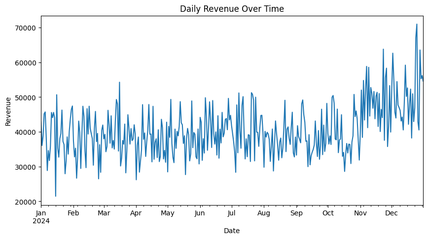
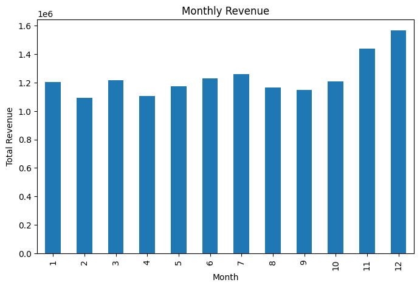
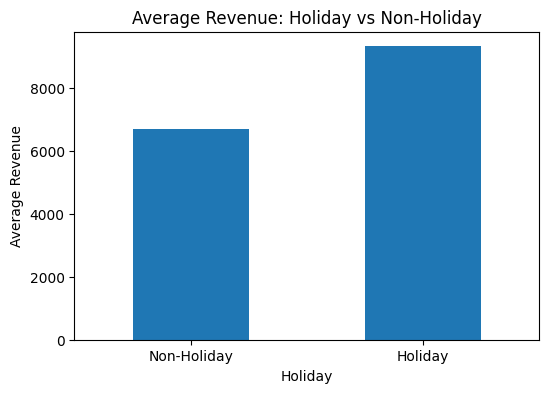

# Sales Forecasting

## Project Overview
This project analyzes retail sales data to identify revenue patterns over time and build a simple baseline forecast. The workflow includes data cleaning, exploratory data analysis (EDA), feature engineering, time series aggregation, and moving average forecasting.

## Objectives
- Clean and prepare sales data for analysis
- Explore revenue trends across time, categories, regions, discounts, and holidays
- Create time-based features for forecasting
- Build a simple moving average baseline model
- Evaluate forecast performance using MAE and RMSE

## Dataset
The dataset includes:

- `date`
- `store_id`
- `product_category`
- `region`
- `units_sold`
- `revenue`
- `discount`
- `marketing_spend`
- `holiday`

## Data Cleaning
The following preprocessing steps were applied:

- Removed duplicate rows
- Filled missing values in `discount` and `marketing_spend` using median values
- Standardized inconsistent category names
- Corrected negative revenue values
- Converted `date` to datetime format

## Feature Engineering
Created additional time-based features:

- `month`
- `day_of_week`
- `quarter`
- `is_weekend`

## Exploratory Data Analysis
The analysis focused on:

- Daily revenue over time
- Monthly revenue
- Revenue by product category
- Revenue by region
- Revenue on holidays vs non-holidays
- Revenue by discount level
- Revenue by product category and holiday status

## Visualizations

### Daily Revenue Over Time
This time series chart shows how revenue changes across the year. Revenue becomes noticeably higher toward the final months, especially in November and December.



### Monthly Revenue
This chart summarizes total revenue by month and highlights stronger performance at the end of the year.



### Revenue by Product Category
This visualization compares total revenue across product categories. Electronics generates the highest revenue by a large margin.


### Holiday vs Non-Holiday Revenue
This chart compares average revenue during holiday and non-holiday periods. Holiday periods show stronger sales performance.



### Forecast vs Actual Revenue
This plot compares the moving average forecast with actual revenue values, showing that the model captures the general level but misses sharper fluctuations.


## Forecasting
A simple moving average baseline was used for forecasting future revenue values.

## Model Evaluation
Forecast performance was evaluated using:

- **MAE:** 6435.45
- **RMSE:** 8408.73

## Key Insight
Revenue increases significantly toward the end of the year, holiday periods generate higher average revenue, and Electronics contributes the largest share of total revenue.

## Tools and Libraries
- Python
- pandas
- numpy
- matplotlib
- scikit-learn

## Project Structure
```bash
sales-forecasting/
│
├── data/
│   └── raw/
│       └── sales_forecasting_raw.csv
├── images/
├── README.md
└── requirements.txt
```

## Future Improvements
Test more advanced forecasting models
Add trend and seasonality decomposition
Compare baseline forecasting with machine learning models

## Author
Nađa Radojičič
